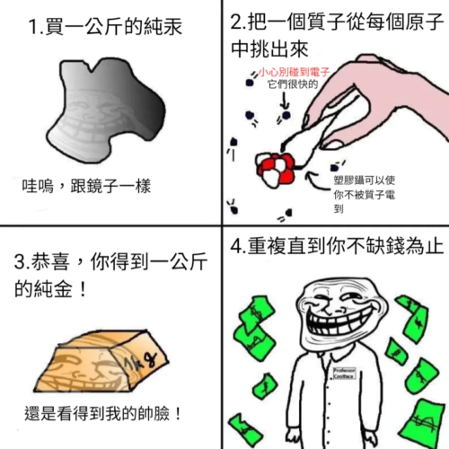

# 彰化高中 113學年度 資訊學科能力競賽 校內複賽

## **試場規則**

### **違規事項**

 - 行動裝置未置於教室外、教室前後、監考老師桌上、個人電腦主機上，經監考老師發現。
 - 於考試期間使用行動裝置。
 - 配戴具通訊功能的穿戴裝置。
 - 以任何方式使其他考生無法正常使用系統。
 - 考試期間與監考老師以外之人交談。

上述行為被發現，且屢勸不聽者，將登記於考生簽到表，並在賽後系統測試時將總成績 $\times 0.0001$ 並四捨五入至個位。

### **賽制**

 - 本次競賽採`OI`制度，有部分分，無罰時，並取每筆提交的子題聯集為總分。
   - 例如：某題共有兩筆提交，第一筆通過子測資 $\\{1,2\\}$ 、第二筆通過子測資 $\\{2,3\\}$ ，則總分為第 $\\{1,2,3\\}$ 筆子測資的分數相加。
 - 本次為封板賽，記分板將在比賽結束後公布。
 - 競賽結束後會做一次***System test***(系統測試)，所有成績以其為準。
 - 提交的冷卻時間(CD time)為 $15$ 秒，最後 $30$ 分鐘不在此限。
 - 對於每一題，使用者最多可以進行 $100$ 筆提交。

### **系統使用說明**

 - 系統連結: [http://192.168.8.1](http://192.168.8.1/)
 - 競賽將在 ***2024/08/29 1:00 P.M.*** 開始，使用者有十分鐘的時間閱讀試場規則，確認讀畢後請按下系統上的開始鈕，以免影響競賽時間。
 - 本次競賽時長共 ***300*** 分鐘。
 - 最晚進場時間 ***2024/08/29 1:30 P.M.***。
 - 最早離場時間 ***2024/08/29 2:00 P.M.***。
 - 總題本在第***A***題的題目敘述頁面中。
 - 使用者允許許使用 ***C/C++11/C++17*** 提交程式碼。
 - 若結果為***Execution timed out (wall clock limit exceeded)***，則表示系統因為某筆提交繁忙中，請檢查你的程式碼使否有可能超過執行時間，並稍後再試。
 - 對於每筆提交，請確認副檔名符合系統要求，詳見系統頁面。
 - 如有題目問題，請使用系統提供的訊息詢問功能提問。
 - 如有其他問題，如：上廁所、需要計算紙、系統使用問題等，請直接舉手向監考老師發問。

### **資源**

 - 賽後我們將會在一天內 **彰中資訊社群** 及 **HARC Discord** 中公告本次題解、總成績。
 - 競賽後將擇期在 ***HARC Discord*** 上進行直播題解。
 - 網址：
   - [彰中資訊社群](https://www.facebook.com/groups/chshcs/)
   - [本次專案](https://mysh212.github.io/CHSH-nhspc113-PRI/)
   - [HARC Discord](https://2120.page.link/HARC)
   - [彰中資訊社Discord](https://2120.page.link/cdc)


<div class='page' />

## **A. 最短路** ***<font color = '#AAAAAA'> The Shortest Path </font>***

`time limit` 2s
`memory limit` 512MB

### ***Statement***

給定一個 $N$ 個節點、$M$ 條邊的無向連通圖，每條邊都有一個從 $1$ 到 $M$ 的編號，其中編號 $i$ 的邊連接著兩點 $u_i, v_i$ 。對於圖中的任意兩點，我們將它們之間的路徑長定義為

- 路徑上所有邊的編號直接相連所得的十進位制數字。

請求出從節點 $1$ 到每個其他節點的最短路徑長。由於這些數字可能非常大，請輸出它們對 $10^9+7$ 取模後的結果。

### ***Input***

$N, \  M$
$u_1, \  v_1$
$u_2, \  v_2$
$\vdots$
$u_M, v_M$

### ***Output***

$distance_2$
$distance_3$
$\vdots$
$distance_N$

- $distance_i$ 為節點  $1$ 到節點 $i$ 的最短路徑長並取模後的結果

<div class='page' />


### ***Sample Input***

```
5 4
1 5
5 2
2 3
3 4
```

### ***Sample Output***

```
12
123
1234
1
```

#### **Explanation**

從節點 $1$ 到節點 $2$ 的最短路徑如下：

$1 \rightarrow 5 \rightarrow 2$
邊 $(1, 5)$ 的編號為 $1$ ， 邊 $(5, 2)$ 的編號為 $2$

因此 $distance_2 = 12$

### ***Note***

- $1 \le N , M \le 10^5$
- $1 \le u_i, v_i \le N$

### ***Subtask***

 - ***subtask1***: $3\\%$ $N, M \le 9$
 - ***subtask2***: $28\\%$ $M = N - 1$
 - ***subtask3***: $28\\%$ $N, M \le 10^2$
 - ***subtask4***: $41\\%$ ***As statement***

<div class='page' />

## **B. 跨欄** ***<font color = '#AAAAAA'> Sprint Hurdles </font>***

`time limit` 1s
`memory limit` 256MB

### ***Statement***

***Omega***  是一位才華橫溢的運動員，他以驚人的彈跳力聞名。在一次特別的跨欄比賽中，他被賦予了一個獨特的挑戰：在一條充滿障礙的跑道上， ***Omega***  必須在精確的 $k$ 步內從起點跑到終點。

然而，這場比賽不僅僅是速度的較量。為了確保他不會因為過大的步幅而拉傷肌肉， ***Omega*** 希望跳躍距離的最大值越小越好，你能幫助她找出最佳策略，讓她成功完成這場挑戰嗎？

具體問題描述如下：

給定一條 $n$ 個單位長的跑道，其中部分單位設有欄架（用 1 表示），其餘單位為空地（用 0 表示）。 ***Omega*** 第一步踏在最左端起跑點，接著每一步找到合適的落腳點空地，在第 $k$ 步恰好抵達最右端的終點。特別注意 ***Omega*** 不會原地踏步。

你的任務是幫助  ***Omega***  計算，在滿足恰好用 $k$ 步到達終點的條件下，最大步長的最小值是多少。

註：青蛙跳躍方向與題目無關


### ***Input***
- 第一行包含兩個整數 $n$ 和 $k$，分別表示跑道的長度和步數。
- 第二行包含長度為 $n$ 的字串 $s$ ，其中 $s_i$ 表示第 $i$ 個單位跑道的狀態。`0`表示空地，`1`表示該位置有欄架。（起點與終點不會有欄架。且保證空地數量大於或等於 $k$）


### ***Output***
輸出一個整數，表示 ***Omega*** 在使用步數恰好為$k$的情況下，最大步長的最小值。


<div class='page' />


### ***Sample Input***
```txt
10 4
0100101000
```


### ***Sample Output***
```txt
4
```


### ***Note***

範測1，採取此策略 $1 \rightarrow 4 \rightarrow 6 \rightarrow 10$ ，最大步長為 $max(4-1, 6-4, 10-6) = 4$

 - $2 \leq n \leq 10^5$
 - $2 \leq k \leq n$

### ***Subtask***

 - ***subtask1***: $13\\%$ $1 \leq n \leq 15, 2 \leq k \leq 5$
 - ***subtask2***: $87\\%$ ***As statement***

<div class='page' />

## **C. 好多零食** ***<font color = '#AAAAAA'> Omega Love Food </font>***

`time limit` 2.5s
`memory limit` 256MB

### ***Statement***
又到了一年一度的中元普渡，資訊館前擺滿了一整排玲瑯滿目的零食， ***Omega*** 決定好好搜刮一波。

然而資訊老師為了公平，規定一個人不能拿走重複種類的零食，一次只能搜刮一次。 ***Omega*** 聽到這個規定，心中忍不住的笑意，今晚女朋友有吃不完的零食了。

已知有 $n$ 個零食一整排成列在桌上， ***Omega*** 兩手一張，可以將連續區間的零食抱回家，但要注意區間內不能有同種類的零食。請你幫他計算他這次可以抱多少的零食回家。


### ***Input***
- 第一行包含兩個整數 $n$ 零食數量。
- 第二行包含 $n$ 個整數 $w_i$，表示零食種類。

### ***Output***
輸出一個整數，表示可以拿到零食的最大數量。


### ***Sample Input***
```txt
8
1 4 2 2 1 3 5 1
```


### ***Sample Output***
```txt
4
```


### ***Note***
範例中， ***Omega*** 可以選擇抱走 $[2, 1, 3, 5]$ ，但不能抱走 $[4, 2, 2, 1, 3]$ 。

 - $1 \le n \leq 10^6$
 - $1 \leq w_i \leq 10^9$


### ***Subtask***

- ***subtask1***: $13\\%$ $1 \le w_i \le n \leq 100$
- ***subtask2***: $22\\%$ $1 \le w_i \le n \leq 2500$
- ***subtask3***: $25\\%$ $1 \le n \leq 2500$, $1  \leq w_i \leq 10^9$
- ***subtask4***: $40\\%$ ***As statement***

<div class='page' />

## **D. 新番補完計劃** ***<font color = '#AAAAAA'> Instrumentality Of Anime Completion </font>***

`time limit` 1s
`memory limit` 256MB

### ***Statement***
**張詩大** 決定在暑假期間補完他所有想看的新番。他把每部想看的新番以字串形式記錄，記錄格式為 `動畫名稱;製作公司;首播日期`，其中各項資訊以 `;` 分隔。動畫名稱與製作公司主要由大小寫英文字母組成，且可能包括阿拉伯數字、標點符號、空格 (這裡保證名稱裡不會有 `;` )。首播日期的格式為 `MM/DD`，其中 `MM` 為兩位數的月份，`DD` 為兩位數的日期。

以今年新番《**鹿乃子乃子乃子虎視眈眈**》為例，其記錄格式為：
`My Deer Friend Nokotan;WIT STUDIO;07/07`

**張詩大** 想將相同製作公司製作的動畫分類在一起，並按首播日期排序。如果首播日期相同，則按動畫名稱的字典序 (由小到大) 排序。由於動畫數量較多，他請求你編寫一個程式來完成這項任務。

#### 字典序由小到大排序的規則：
將兩個字串從左到右逐位比較，當發現字元的 ASCII 值不相同時，將 ASCII 值較小的字串排在前面。如果兩字串在所有位置上的字元都相同，則較短的字串排在前面。


<div class='page' />


### ***Input***
$S_1$
$S_2$
$\vdots$
$S_n$

輸入以 EOF (End of File) 作為結束。

### ***Output***
$C_i$
$A_1$
$A_2$
$\vdots$
$A_i$
$\vdots$

第一行 $C_i$ 為製作公司名稱。

第二行起 $A_i$ 為該公司製作的動畫名稱，這些字串依首播日期輸出，若首播日期相同，則依照動畫名稱字典序由小到大輸出，輸出完一個動畫請換下一行。

輸出完該公司全部動畫後，請輸出 "--------------------------------------------------" 當作分隔線 (需恰好 50 個 `-` )，若之後無任何輸出則不用分隔線 (請參考範測輸出)。

每個製作公司名稱的輸出順序應按照其在輸入中出現的先後順序。


<div class='page' />


### ***Sample Input***
```
Alya Sometimes Hides Her Feelings in Russian;Doga Kobo;07/03
My Deer Friend Nokotan;WIT STUDIO;07/07
Too Many Losing Heroines!;A-1 Pictures;07/14
Oshi no Ko Season 2;Doga Kobo;07/03
Suicide Squad ISEKAI;WIT STUDIO;06/27
Jellyfish Can't Swim in the Night;Doga Kobo;04/07
```

### ***Sample Output***
```
Doga Kobo
Jellyfish Can't Swim in the Night
Alya Sometimes Hides Her Feelings in Russian
Oshi no Ko Season 2
--------------------------------------------------
WIT STUDIO
Suicide Squad ISEKAI
My Deer Friend Nokotan
--------------------------------------------------
A-1 Pictures
Too Many Losing Heroines!
```


### ***Note***
* $9 \leq S.size() \leq 200$
* $S_i \neq S_j\ \ (i \neq j)$
* 總字串數 $\leq 100$
* 保證動畫名稱與製作公司不會留白
* 每部動畫都有唯一的首播日期
* 輸入測資為 MyAnimeList 2024/01/01 ~ 2024/08/31 的新番資訊


### ***Subtask***

 - ***task***: $100\\%$ ***As statement***

<div class='page' />

## **E. 會贏喔** ***<font color = '#AAAAAA'> I Will Win </font>***

`time limit` 1s
`memory limit` 256MB

### ***Statement***

在一個遙遠的倉鼠王國裡，有一位國王 $hamster$，他召集具有咒力的術師來到廣場

廣場充滿了術師，這 $1 \sim N$ 個術師分別擁有 $1 \sim N$ 的咒力。

也就是說沒有術師的咒力會等於其他術師 

如 $N=5$ 時 所有術師依咒力表示分別為 $[1,2,3,4,5]$ 沒有術師的咒力會等於其他術師 

國王希望能夠排列這些術師使得從左側可以看到恰好 $K$ 個術師

每一個術師具有的咒力，只有當他左側沒有比它更強的術師時，他的咒力才能被完全釋放，從而被看到。

例如，如果術師的排列依咒力表示為 $[1,3,2,5,4]$，那麼咒力為 $1$、$3$ 和 $5$ 的術師從左側可見，因為他們左側沒有比他們咒力更強的術師。


給定 $N$ 和 $K$，輸出符合條件排列的數量

由於答案可能很大請先 $mod\space 10^9 + 7$。後再輸出 $Ans$


### ***Input***
$N\space K$
### ***Output***
$Ans$

<div class='page' />


### ***Sample Input 1***
```
3 2
```


### ***Sample Output 1***
```
3
```

### ***Sample Input 2***
```
5 5
```


### ***Sample Output 2***
```
1
```

### ***Sample Input 3***
```
20 11
```


### ***Sample Output 3***
```
647427950
```
### ***Note***

$1 \leq N \leq 10^{3}$

$1 \leq K \leq 10^{3}$


### ***Subtask***

 - ***subtask1***: $3\\%$  $N=1$
 - ***subtask2***: $7\\%$  $N=K$
 - ***subtask3***: $11\\%$  $K=1$
 - ***subtask4***: $27\\%$ $1\leq  N \leq 10$
 - ***subtask5***: $52\\%$ ***As statement***


<div class='page' />

## **F. HARC** ***<font color = '#AAAAAA'> Hiding A Real Capability </font>***

`time limit` 1s
`memory limit` 256MB

### ***Statement***


給定 $N$ 與4個長度為 $N$ 的字串$s1,s2,s3,s4$
字串將由 ***H A R C*** ，共 $4$ 個字母組成
***Dumbledore*** 可以施展多次黑魔法
進行以下其中一個操作 順序不限
- 如果 $s2[i-1]$ 等於 $s2[i+1]$ 且 $s2[i+1]$ 等於 ‘A’ ，$s1[i]$ 變為 'H' $\forall$ i $\in$ $1 \text{~} N-2$
- 如果 $s3[i-1]$ 等於 $s3[i+1]$ 且 $s3[i+1]$ 等於 ‘R’ ，$s2[i]$ 變為 'A' $\forall$ i $\in$ $1 \text{~} N-2$
- 如果 $s4[i-1]$ 等於 $s4[i+1]$ 且 $s4[i+1]$ 等於 ‘C’ ，$s3[i]$ 變為 'R' $\forall$ i $\in$ $1 \text{~} N-2$
- 如果 $s1[i-1]$ 等於 $s1[i+1]$ 且 $s1[i+1]$ 等於 ‘C’ ，$s4[i]$ 變為 'C' $\forall$ i $\in$ $1 \text{~} N-2$

***meloneater*** 希望你算出經歷多次黑魔法後 $s1$ 最多能有多少字母 ***H***

### ***Input***
$N\space$
$s_1$
$s_2$
$s_3$
$s_4$
### ***Output***
$Ans$


### ***Sample Input 1***
```
4
HRHH
ACAA
RHRR
CACC
```


### ***Sample Output 1***
```
4
```

<div class='page' />


### ***Sample Input 2***
```
3
HCC
ACA
RHR
CAC
```


### ***Sample Output 2***
```
2
```

### ***Sample Input 3***
```
1
A
R
C
H
```


### ***Sample Output 3***
```
0
```
### ***Note***

$1 \leq N \leq 10^{5}$


### ***Subtask***

 - ***subtask1***: $5\\%$  $N=1$
 - ***subtask5***: $95\\%$ ***As statement***


<div class='page' />

## **G. 桌遊** ***<font color = '#AAAAAA'> Board Game </font>***

`time limit` 2s
`memory limit` 256MB

### ***Statement***

$\text{Derek}$ 發明了一個桌遊，在這個遊戲中，有 $N$ 名玩家會依次將牌放到桌子中心上。玩家的編號從 $1$ 到 $N$。最初，每位玩家都被分配了 $K$ 張牌，這些牌的值分別是 $C_{i,1}, \  C_{i,2}, \  \dots, \  C_{i,K}$。已知所有牌的值都在 $1$ 到 $N \times K$ 之間，並且這 $N \times K$ 張牌的值各不相同。

遊戲的規則如下：

1. 最初桌子中心是空的。
2. 每輪中，輪到的玩家必須從手中的牌中選擇一張，並將其疊到中心的牌堆上面。
3. 遊戲的第一輪，放置的牌可以是任何值。
4. 從第二輪開始，放置的牌的值必須是當前中心堆頂牌值的倍數。
5. 每張牌只能使用一次。
6. 在第 $p$ 位玩家的回合結束後，下一個輪到的是第 $(p \  \\% \ N+1)$ 位玩家。
7. 第一位無法在自己回合中放置有效牌的玩家是遊戲的輸家。

問題來了，$\text{Derek}$ 想知道這場遊戲有多少種「結局」，也就是有多少對 $(s, t) \  (1 \le s, t \le N)$ 使得存在一場遊戲滿足
- 第 $s$ 位玩家在第一輪開始，而第 $t$ 位玩家輸掉遊戲

### ***Input***

$N ,\  K$

$C_{1,1}, \  C_{1,2}, \  \dots, \  C_{1,K}$
$C_{2,1}, \  C_{2,2}, \  \dots, \  C_{2,K}$
$\vdots \  \ \ \ \ \ \ \ \ \ \ \  \ddots$
$C_{N,1}, \  C_{N,2}, \  \dots, \  C_{N,K}$

### ***Output***

$Ans$

<div class='page' />


### ***Sample Input***

```
3 3
1 2 3
4 5 6
7 8 9
```

### ***Sample Output***

```
5
```

#### **Explanation**

$(2, 3)$是其中一種「結局」。
1. 第$2$位玩家將值為$5$的卡放在牌堆上
2. 第$3$位玩家沒有合法的卡可以選擇
因此第$3$位玩家輸了這場遊戲

### ***Note***

- $1 \le N \le 2 \times 10^5$
- $1 \le K \le 2 \times 10^5$
- $1 \le N \times K \le 2 \times 10^5$
- $1 \le C_{i,j} \le N \times K$
- 每個$C_{i,j}$都是相異的

### ***Subtask***

 - ***subtask1***: $7\\%$ $N = 2, K \le 5000$
 - ***subtask2***: $13\\%$ $N = 2$
 - ***subtask3***: $34\\%$ $N \times K \le 10^4$
 - ***subtask4***: $46\\%$ ***As statement***

<div class='page' />

## **H. 桌遊 2** ***<font color = '#AAAAAA'> Board Game 2 </font>***

`time limit` 2s
`memory limit` 256MB

### ***Statement***

$\text{Derek}$ 發明了第二個單人桌遊。這個遊戲有一疊牌堆，一開始共有 $2 \times N$ 張牌。每張牌的編號從 1 到 $2 \times N$，值為 $A_i$。
遊戲流程如下：

- 首先，從牌堆上面抽出 $N$ 張牌並放到桌面上。
- 接下來的每一輪，玩家必須從桌面上的牌中選擇一張拿到手上。
- 當前玩家手上所有牌（包括剛選擇的牌）的值的總和即為此輪的得分。
- 如果牌堆中還有牌，則從牌堆最上方再拿一張牌放到桌上。
- 遊戲總共進行 $2 \times N$ 輪，每輪的得分總和即為遊戲的最終總分。

現在$\text{ Derek }$好奇所有不同的**選擇流程**所獲得的總分加起來是多少？

- 我們定義選擇流程為 $[p_1, p_2, \dots, p_{2N}]$，其中 $p_i$ 表示玩家在第 $i$ 輪中選擇的牌的編號。

由於答案可能非常大，請輸出答案對 $998244353$ 取模後的結果。
### ***Input***

$N$
$A_1, \ A_2, \ \dots, \ A_{2N}$

### ***Output***

$Ans \ \\% \ 998244353$

<div class='page' />


### ***Sample Input***

```
2
1 2 3 4
```

### ***Sample Output***

```
177
```

#### **Explanation**

其中一種選擇流程如下

- 一開始桌面上有$[1, 2]$兩張牌
- 玩家將值為$2$的牌拿到手中，此輪玩家獲得$2$分
- 當前桌上有$[1, 3]$兩張牌，玩家將值為$1$的牌拿到手中，此輪玩家獲得$2 + 1 = 3$分
- 當前桌上有$[3, 4]$兩張牌，玩家將值為$4$的牌拿到手中，此輪玩家獲得$2 + 1 + 4 = 7$分
- 當前桌上有$[3]$一張牌，玩家將值為$3$的牌拿到手中，此輪玩家獲得$2 + 1 + 4 + 3 = 10$分
- 遊戲結束，選擇流程$[2, 1, 4, 3]$的總分為$2 + 3 + 7 + 10 = 22$分

### ***Note***

- $1 \le N \le 2 \times 10^5$
- $1 \le A_i \le 10^9$

### ***Subtask***

 - ***subtask1***: $11\\%$ $N \le 5$
 - ***subtask2***: $89\\%$ ***As statement***

<div class='page' />

## **I. 賭博破產我轉職成大魔法師** ***<font color = '#AAAAAA'> Bankrupt Gambler Reborn As A Mage </font>***

`time limit` 1s
`memory limit` 256MB

### ***Statement***
**MelonWalker** 因為跟 **EBF II** 賭博賭到破產，於是跑去跟傳說中的大魔法師 **Hamster** 拜師，並被授予了***把錢變奇數的魔法***：
* 假設當前有 $X$ 元，則施予魔法後變成 $2X + 1$ 元。

但因為 **MelonWalker** 輸錢的速度太快了，所以又自創了***把錢變四倍的魔法***：
* 假設當前有 $X$ 元，則施予魔法後變成 $4X$ 元。

不過這兩個魔法都有限制，假設透過魔法將原先的金額 $X$ 變為 $Y$，並 $Y \geq 2^{N}$ 時，將會被上帝抓到洗錢行為，使其金額歸 $0$。

**MelonWalker** 好奇利用任意次數的這兩種魔法能使他的金額變成哪些數字，請計算出所有可能數，並輸出所有可能數除以 $10^9 + 7$ 的餘數。

這裡他一開始的金額為 $0$ 元，並且他至少會施一次魔法，不然沒錢賭博。



<div class='page' />

### ***Input***
$N$

其中 $N$ 代表最終金額需小於 $2^N$

### ***Output***
$Ans$

其中 $Ans$ 代表所有可能數除以 $10^9 + 7$ 的餘數

### ***Sample Input 1***
```
5
```

### ***Sample Output 1***
```
12
```

所有 $< 2^{5}$ 並且可用這兩種魔法變成得數字有 $1, 3, 4, 7, 9, 12, 15, 16, 19, 25, 28, 31$，共 $12$ 種。

以 $19$ 為例：
* 使用 ***把錢變奇數的魔法***：$0 \to 2 \times 0 + 1 = 1$
* 使用 ***把錢變四倍的魔法***：$1 \to 4 \times 1 = 4$
* 使用 ***把錢變奇數的魔法***：$4 \to 2 \times 4 + 1 = 9$
* 使用 ***把錢變奇數的魔法***：$9 \to 2 \times 9 + 1 = 19$

<div class='page' />


### ***Sample Input 2***
```
10
```

### ***Sample Output 2***
```
143
```


### ***Note***
* $0 \leq N \leq 10^{18}$


### ***Subtask***

 - ***subtask1***: $30\\%$ $\ N \leq 20$
 - ***subtask2***: $30\\%$ $\ N \leq 10^6$
 - ***subtask3***: $40\\%$ ***As statement***

<div class='page' />

## **J. 蘋果** ***<font color = '#AAAAAA'> Apple </font>***

`time limit` 1s
`memory limit` 256MB

### ***Statement***

***ysh*** 來到了一片 $k \times k$ 的方形森林，裡面有好多蘋果樹，他發現每顆蘋果都有著屬於自己的美味值，現在 ***ysh*** 想要吃到美味值為 $n$ 的蘋果，你可以告訴他那裡有著這樣的蘋果嗎?

### ***Input***

$n$
$a_{(1,1)}$ $a_{(1,2)}$ ... $a_{(1_k)}$
...
$a_{(k,1)}$ $a_{(k,2)}$ ... $a_{(k_k)}$

### ***Output***

$m$
$x_1$ $y_1$
$x_2$ $y_2$
...
$x_m$ $y_m$

 - $m$ 為輸出筆數，代表在這片森林中，共有幾顆 ***ysh*** 想要的蘋果
 - $1 \leq x_i,y_i \leq k,\ \forall\ 1 \leq i \leq k$
 - 輸出請按照字典序輸出。

<div class = 'page' />

### ***Sample Input***

```
5
7 5 8
2 9 0
5 4 5
```

### ***Sample Output***

```
3
1 2
3 1
3 3
```

### ***Note***

 - $0 \leq n \leq 10^{18}$
 - $0 \leq a_{(i,j)} \leq 10^{18},\ \forall\ 1 \leq i,j \leq k$
 - $0 \leq k \leq 2000$

### ***Subtask***

 - ***subtask1***: $10\%$ $k \leq 1,\ a_{(i,j)} \leq 10,\ \forall\ 1 \leq i,j \leq k$
 - ***subtask2***: $10\%$ $k \leq 100,\ a_{(i,j)} \leq 10^4,\ \forall\ 1 \leq i,j \leq k$
 - ***subtask3***: $10\%$ $k \leq 1000,\ a_{(i,j)} \leq 10^9,\ \forall\ 1 \leq i,j \leq k$
 - ***subtask4***: $20\%$ $k \leq 1000,\ a_{(i,j)} \leq 10^{18},\ \forall\ 1 \leq i,j \leq k$
 - ***subtask5***: $50\%$ ***As statement***